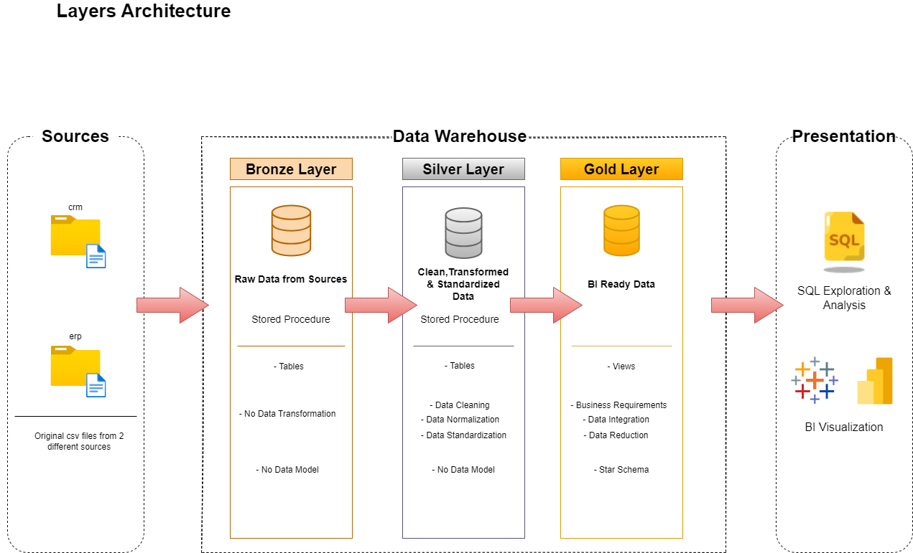

# Introduction

This project is my first step into data engineering and demonstrates the end-to-end development of an on-premise data warehouse tailored for an investment firm. In this scenario, the goal is to organize raw data stored across multiple sources into a structured, analytics-ready platform optimized for reporting and decision-making.

# Goals

A) Build a modern data warehouse (DWH) optimized for scalability,performance and maintainability, ensuring it can handle growing data volumes.

B) Structure the data to provide BI-ready datasets, enabling seamless consumption by the firm’s data analysts for reporting and decision-making.

# Dataset

In this project, I simulated the creation of the raw data using Python, trying to reflect the complexity and diversity of real-world datasets from an investment firm.

# My Tools for the Project

- **Python:**  A flexible programming language with tons of helpful libraries that made it easy for me to create my dataset. 
- **SQL Server (SQLS):**  A powerful database system I used to store my data and run fast, efficient queries. 
- **SQL:**  The go-to language I used to interact with my data. 
- **Git:**  My trusty version control tool that helped me keep track of changes. 
- **GitHub:**  Where I shared my SQL scripts and kept everything organized, making it easier to track progress. 
- **Draw.io:**  A simple yet powerful tool I used to design and visualize the architecture of my data warehouse. 

# Overview

## Raw Data Structure and Source Integration

This diagram represents how the raw data was stored when extracted from the source systems and the relationships between the CSV files.

## Data Architecture

A clear description of the process. A diagram of the  Medallion Architecture showing the exact ETL pipeline, highlighting how raw data is transformed into analytics-ready datasets.
    

- **Bronze Layer :** Holds raw data exactly as it comes from CSV files, loaded into a SQL Server Database.  
- **Silver Layer :** Cleans up and organizes the data, getting it ready for analysis.  
- **Gold Layer :** Final stop—data is structured into a star schema for reports and insights.
     

## Data Flow

The path of raw data from its source to the final stage, ready for analytics and visualization.

## Data Model

This structured data model follows a star schema design , optimized for analytics and reporting. It consists of three fact tables , surrounded by three dimension tables.

Feel free to check the scripts [here](https://github.com/theodorosmalezidis/DWH_project/tree/main/scripts). These include the ETL processes and SQL queries used to build and populate the Bronze, Silver, and Gold layers of the data warehouse.

